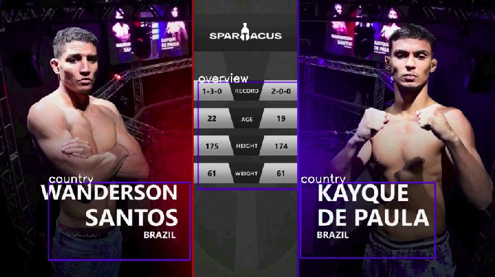

# MMA reconition

####  Описание задачи:

Даны видеоматериалы с боев MMA. Каждый видеоролик — это один бой. Необходимо
оцифровать всплывающие окна с информацией:

• о бое (какой номер раунда, какая секунда боя в данный момент)

• бойцах (имена, цвет (чаще всего красный/синий))

• другие.

#### Решение:
На видео выходит как минимум 3 разных окон с информацией. Оцифровку всплывающих окон можно разделить на этапы:

• Разделить видео на кадры

• Object detection

• Segmentation

• Recognition


### Object Detection
Окна с информацией можно разделить на 6 классов: overview, name, time, country, round, winner.

Была обучена модель YOLOv5. В общем собрано 1516 данных с фотографиями(80/20/20). Были собраны кадры с информацией overview and country, name and time, time and round, winner. Для баланса данных каждый из классов содержит не более 400 фотографий. Для аннотации использована VCC Ann и Roboflow. Так как они имеют одинаковые координаты данные размечались полуручным методом на питоне.



### Recognition
Для распознавания текста на кропе использована библиотека easyocr. Были варианты c tesseract-ом или же обучением ocr. Но easyocr показал достаточно хороший результат. C билиотекой можно скачать пакеты для английских слов и запустить команду reader.readtext(image_part) c GPU.

Для распознавания цвета бойца использовалось opencv с сравнением красного и синего в классе name.

### Storing
Результаты хранится в json файле file_res.json


## Installation:


```bash
python3 -m venv venv
pip install -r requierments.txt
cd repos/
git clone https://github.com/ultralytics/yolov5
```

## Запуск проекта
```bash
python main.py --path_video ./test.mp4 --path_result file_res.jsons
```

